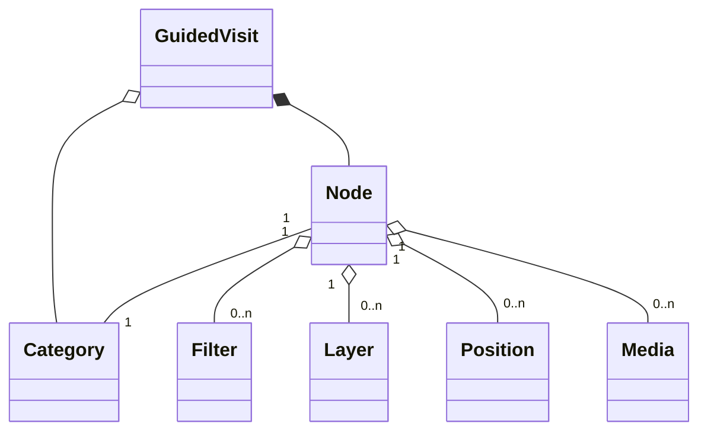
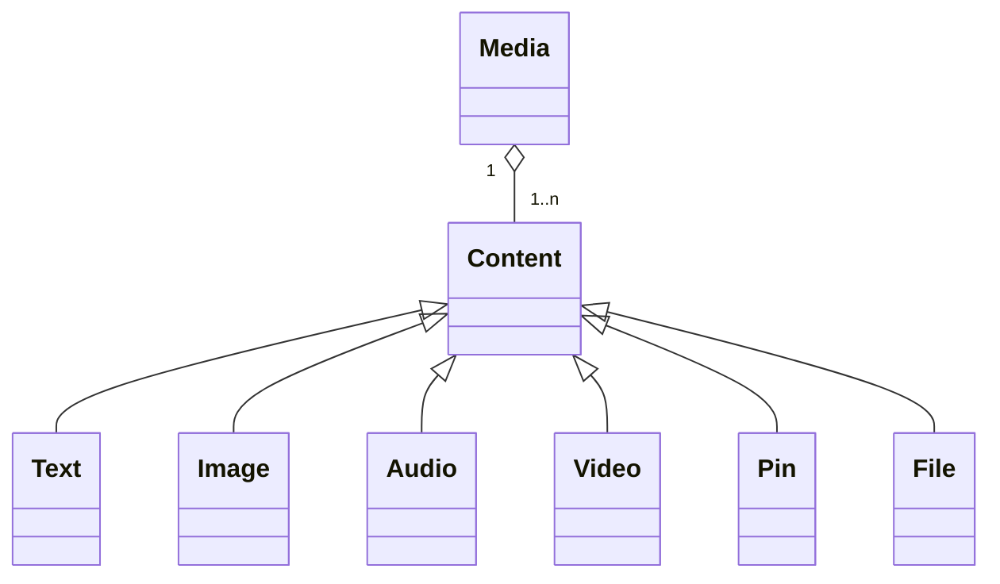

# Vallée du Gier

This demo offers tools to create 3D and geographic storytellings with urban data, geographic layers and medias. The demo uses [UD-Viz](https://github.com/VCityTeam/UD-Viz) to create the 3D view and to host it on the web.

Different examples are available with the demo (see [install and run the demo](#installing-and-running-the-demo)). Those examples are about [Vallée du Gier](./assets/layers/COMMUNES_GIER_4326.geojson)'s industry.


## Installing and running the demo

The demo application can be locally (on your desktop) started in the following way:

```bash
npm i
npm run build
python3 -m http.server
```

and then use your favorite (web) browser to open `http://localhost:8000/`.

## About the 3D View

### Layer

The layers can be configured in [layerConfig.json](./assets/config/layerConfig.json). The way to configure the layers depends on the [UD-Viz](https://github.com/VCityTeam/UD-Viz) version. You can check the [UD-Viz examples](https://github.com/VCityTeam/UD-Viz/tree/master/examples) for layer configuration examples.

A `Layer` is data displayed in the 3D view. There are different types of layers:

#### Base map layers

Base map layers are the base of the view. They are the maps on which the other layers will be placed.

#### Elevation layer

The elevation layer adds relief to the displayed map.

#### Color layers

Color layers add GeoJSON data directly on the map. They are displayed as points, polygons or polylines. The style can be configured for each color layer.

#### Label layers

Label layers add GeoJSON data as text above the map. The data should be GeoJSON points in order to place it correctly. The style of the text can be configured for each label layer.

#### 3D Tiles layers

3D Tiles layers are 3D models with geographic positions. Those models have a spatial tiling, allowing to load only some parts of the data according to the camera position.

### Filter

Filters allow to temporary change the data displayed by a layer. A filter can be applied on a [color layer](#color-layers), a [label layer](#label-layers) or a [3D Tiles layer](#3d-tiles-layers).

If the layer is a color or a label layer, the filter creates a new temporary layer with filtered data and hides the parent layer. The temporary layer is deleted and the parent layer set visible when the filter is removed.

If the layer is a 3D Tiles layer, the filter will add color to the 3D models. Those colors are removed when the filter is removed.

The way to create and use filters is different in the Guided Visit or the Open Visit. See [Guided Visit filters](#filters) and [Open Visit filters](#filter-content).

### Caption

The captions can be configured in [captionConfig.json](./assets/config/captionConfig.json).

`Captions` allow to add context to displayed layers and filters. Each caption has a `description` and a `style`. The caption is linked to a layer or a filter by its `id` (the ID of the caption should be the same as the layer/filter ID).

The caption style type can be either `plain`, `text`, `border` or `image`.

Example:

```json
{
  "description": "Layer 1",
  "id": "layer_01",
  "style": {
    "color": "#FF0000",
    "type": "plain"
  }
}
```

If the caption has the type `image`, replace `color` by a `path`:

```json
{
  "description": "Filter 1",
  "id": "filter_01",
  "style": {
    "path": "../assets/logos/caption_img.png",
    "type": "image"
  }
}
```

## About Guided Visits

Each guided visit is a sequence of steps, called `Nodes`. Each can have a geographic position, layers and medias (images, texts, etc), allowing to create a 3D and geographic storytelling.

### Visits

The visits can be configured in [visitConfig.json](./assets/config/visitConfig.json).

A `Visit` has a set of [`Nodes`](#nodes), a `startIndex` and a `endIndex`. Thoses indexes indicate which is the first step and the last step of the visit.

A `Visit` also has [`Categories`](#categories). Those categories allow to navigate through the visit by theme, without seeing all the steps of the visit.

The `name` and the `description` attributes will be used to display information about the visit in the visit selection.



| Attribute   | Required               |
| ----------- | ---------------------- |
| id          | :white_check_mark: Yes |
| name        | :white_check_mark: Yes |
| description | :white_check_mark: Yes |
| startIndex  | :white_check_mark: Yes |
| endIndex    | :white_check_mark: Yes |
| categories  | :red_circle: No        |
| nodes       | :white_check_mark: Yes |

Example:

```json
{
  "id": "01",
  "name": "Example visit",
  "description": "This is an example of visit config",
  "startIndex": 0,
  "endIndex": 10,
  "categories": [], // See Categories
  "nodes": [] // See Nodes
}
```

### Categories

Categories allow to navigate through the visit without seeing all the nodes. Each category is linked to a [`Node`](#nodes) index. The categories will be displayed in the header of the HTML panel and clicking on a category allows to go directly to the targeted node.

| Attribute | Required               |
| --------- | ---------------------- |
| id        | :white_check_mark: Yes |
| name      | :white_check_mark: Yes |
| nodeIndex | :white_check_mark: Yes |

Example:

```json
{
  "id": "INTRO",
  "name": "Introduction",
  "nodeIndex": 0
}
```

### Nodes

A node is a step of a Guided Visit. Each node is linked to a previous and a next node with `previous` and `next` indexes. If a node is the first node of the visit, its `previous` index must be the same the `startIndex` of the visit. If it's the last node, its `next` index must be the same as the `endIndex` of the visit.

A node has an attribute `layers`, which is a list of layer IDs. This list will define which layers are displayed and hidden at each step of the visit: among all the [layers created by the 3D view](#layer), only those with their ID in the list will be displayed. If the list is empty or the `layers` attribute is missing, all layers will be displayed.

A node can have an attribute `medias`, which is a list of [`Media`](#medias) IDs. All the medias with their ID in the list will be displayed, one under the other, in the main panel of the visit.

A node can have an attribute `filters`, which is a list of [`Filters`](#filters). See [above](#filter) if you want to know what is a filter.

A node can have a `position` and a `rotation`, allowing to move the camera to a specific position in the 3D view. The position must be a Vector3 with `x`, `y` and `z` and its coordinates must have the same projection as the 3D view. The rotation must be a Quarternion with `x`, `y`, `z` and `w`. The node should either both attributes or neither.

| Attribute | Required                 |
| --------- | ------------------------ |
| previous  | :white_check_mark: Yes   |
| next      | :white_check_mark: Yes   |
| layers    | :red_circle: No **\***   |
| medias    | :red_circle: No          |
| filters   | :red_circle: No          |
| position  | :red_circle: No **\*\*** |
| rotation  | :red_circle: No **\*\*** |

\* Even if the attribute is optional, it should always be present if the [layer configuration](#about-the-3d-view) creates multiple base map layers.  
\*\* `position` is required if `rotation` is present and vice versa.

Example:

```json
{
  "previous": 0,
  "next": 1,
  "type": "half",
  "layers": ["layer_id"],
  "medias": ["Media_01"],
  "filters": [], // See Filters
  "position": {
    "x": 1815137.4389101316,
    "y": 5120561.345129335,
    "z": 74890.18365784828
  },
  "rotation": {
    "x": 0.20020493997826672,
    "y": 0.0010948816804666021,
    "z": 0.0053579998619824485,
    "w": 0.9797387790017721
  }
}
```

### Filters

Filters can be used to style an existing layer or to display only specific parts of an existing layer. See [above](#filter) if you want to know what is a filter.

A filter must have a `layer`, which is the **ID** of the layer on which the filter will be applied.

A filter also has `properties`, used to set the filter. The configuration of the properties depends on the type on layer:

- On a JSON layer, `properties` must be a [JSON Schema `properties`](https://json-schema.org/learn/getting-started-step-by-step#defining-the-properties). The JSON schema will be applied to each Feature of the layer. Only those accepted by the schema will be **displayed**.
- On a 3D Tiles layer, `properties` can be used to apply a style on features depending on their [Batch Table properties](https://github.com/CesiumGS/3d-tiles/blob/main/specification/TileFormats/BatchTable/README.md). The properties must contain an `attribute` (the name of the attribute used by the filter), an `attribute_values` (the list of values accepted by the filter) and a `style`. The style must have a `materialProps` field, containing [THREE.JS MeshStandardMaterial properties](https://threejs.org/docs/#api/en/materials/MeshStandardMaterial) (such as `color`, `emissive`, `roughness`, etc.).

| Attribute  | Required               |
| ---------- | ---------------------- |
| layer      | :white_check_mark: Yes |
| properties | :white_check_mark: Yes |

Filter on JSON layer example:

```json
{
  "layer": "json_layer",
  "properties": {
    "COMMUNE": {
      "type": "string",
      "enum": ["AA", "BB"]
    }
  }
}
```

It will filter the JSON layer by displaying only the features which have an attribute `"COMMUNE"` equal to `"AA"` or `"BB"`.

Filter on 3D Tiles layer example:

```json
{
  "layer": "3dtiles_layer",
  "properties": {
    "attribute": "attr_1",
    "attribute_values": ["A"],
    "style": {
      "materialProps": {
        "color": "#202020"
      }
    }
  }
}
```

It will filter the 3D Tiles layer by applying a black color to the features which have an attribute `"attr_1"` equal to `"A"`.

### Medias

The medias can be configured in [mediaConfig.json](./assets/config/mediaConfig.json).

A media can be linked to different nodes to display a set of contents, such as texts, images, videos, etc. Each media must have **at least** one content.

A media must have an ID, used to link the media to a node. The `name` can be used has a title and a description of the media.

A media must have a list of [`contents`](#media-contents), described below.



| Attribute | Required               |
| --------- | ---------------------- |
| id        | :white_check_mark: Yes |
| name      | :white_check_mark: Yes |
| contents  | :white_check_mark: Yes |

Media example:

```json
{
  "id": "Media_01",
  "name": "Name of the media",
  "contents": [] // See Media Contents
}
```

#### Media Contents

A media content must have a `type`. This type is either a `text`, `image`, `audio`, `video`, `pin` or a `file`.

The rest of the configuration depends on the content type, more information below.

| Attribute | Required               |
| --------- | ---------------------- |
| type      | :white_check_mark: Yes |
| value     | :white_check_mark: Yes |
| caption   | :red_circle: No **\*** |
| position  | :red_circle: No **\*** |

\* Required only if the content type is `pin`

**Text**: the value is raw text

Example:

```json
{
  "type": "text",
  "value": "This is raw text."
}
```

**Image**: the value is a link to an image (http or relative link).

Example:

```json
{
  "type": "image",
  "value": "../assets/media/images/IMG_01.jpg"
}
```

**Audio**: the value is a link to an audio (http or relative link).

Example:

```json
{
  "type": "audio",
  "value": "../assets/media/audios/AUD_01.mp3"
}
```

**Video**: the value is a link to a video (http or relative link).

Example:

```json
{
  "type": "video",
  "value": "../assets/media/videos/VID_01.mp4"
}
```

**Pin**: place an image at a geographic position in the 3D view. The value is a link to an image (http or relative link). The caption is displayed beside the image.

Example:

```json
{
  "type": "pin",
  "value": "../assets/media/images/IMG_01.jpg",
  "caption": "Pinned image caption",
  "position": {
    "x": 1826924.6322969063,
    "y": 5148677.232349239,
    "z": 266.6366424560547
  }
}
```

**File**: load the content of the file in a HTML div. The content of the file can be raw text or HTML. The value is a link to a text file (http or relative link).

Example:

```json
{
  "type": "file",
  "value": "../assets/media/texts/TXT_01.txt"
}
```

## About Open Visit

The open visit can be configured in [openVisitConfig.json](./assets/config/openVisitConfig.json).

In the open visit, we can explore freely the 3D scene and the data.

The open visit allows to:

- Show and hide layers
- Apply pre-defined filters on layers
- Click on buiildings to display their information

The open visit can have a `name` and a `description`. Those fields are not mandatory.

The open visit must have `layers`, which is the list of layers used. See [layers](#layers).

A field `selection_target` must also be present, which is the ID of the 3D Tiles layer containing the buildings on which the user can click to display information. The ID of the targeted layer must be present in `layers`.

The open visit can also have `contents`, allowing to create filters and categories of filters. See [contents](#open-visit-contents).

| Attribute        | Required               |
| ---------------- | ---------------------- |
| name             | :red_circle: No        |
| description      | :red_circle: No        |
| selection_target | :white_check_mark: Yes |
| layers           | :white_check_mark: Yes |
| contents         | :red_circle: No        |

Example:

```json
{
  "name": "Open Visit Example",
  "description": "This is an open visit example",
  "selection_target": "layer_id",
  "layers": [], // See Layers
  "contents": [] // See Open Visit Contents
}
```

### Open Visit contents

Open visit contents are either [categories](#category-content) or [filters](#filter-content). It allows to create pre-defined filters or categories of filters.

#### _Category_ Content

A category must have a `name`, which is a short description of what the category contains.

A category must have `type` field equal to `category`. This type distinguishes categories from filters.

A category can have `contents`, which are either categories or filters.

| Attribute | Required               |
| --------- | ---------------------- |
| name      | :white_check_mark: Yes |
| type      | :white_check_mark: Yes |
| contents  | :red_circle: No        |

Example:

```json
{
  "name": "Example category",
  "type": "category",
  "contents": [] // Each content of "contents" can be either Category or Filter
}
```

#### _Filter_ Content

A filter must have `type` field equal to `filter`. This type distinguishes filters from categories.

A filter must have a `id`, this ID will be used to identify the filter and to link the filter to a [caption](#caption).

A filter must have a `layer`, which is the ID of the layer on which the filter is applied.

A filter must have a `default` value, either `show` or `hide`, indicating if the filter should be visible or invisible by default.

A filter also has `properties`, used to set the filter. The configuration of the properties is explained in [Guided Visit Filters](#filters).

| Attribute  | Required               |
| ---------- | ---------------------- |
| type       | :white_check_mark: Yes |
| layer      | :white_check_mark: Yes |
| id         | :white_check_mark: Yes |
| default    | :white_check_mark: Yes |
| properties | :white_check_mark: Yes |

3D Tiles layer filter example:

```json
{
  "type": "filter",
  "layer": "layer_id",
  "id": "Filter_01",
  "default": "show",
  "properties": {
    "attribute": "attr_1",
    "attribute_values": ["A", "B", "C"],
    "style": {
      "materialProps": {
        "color": "#ff0000"
      }
    }
  }
}
```

### Layers

The `layers` list allows to set the layers of the open visit. Each layer configuration must have an `id` and a `default` value. The `default` value must be either:

- `show`: the layer will be **visible** by default. The layer can be toggled on/off.
- `hide`: the layer will be **invisible** by default. The layer can be toggled on/off.
- `no_caption`: the layer will **always** be **visible** but won't have a caption. The layer **can't** be toggled on/off.

| Attribute | Required               |
| --------- | ---------------------- |
| id        | :white_check_mark: Yes |
| default   | :white_check_mark: Yes |

Example:

```json
{
  "id": "layer_id",
  "default": "show" // Layer visible by default
}
```

```json
{
  "id": "layer_id",
  "default": "no_caption" // Layer visible but without caption
}
```
