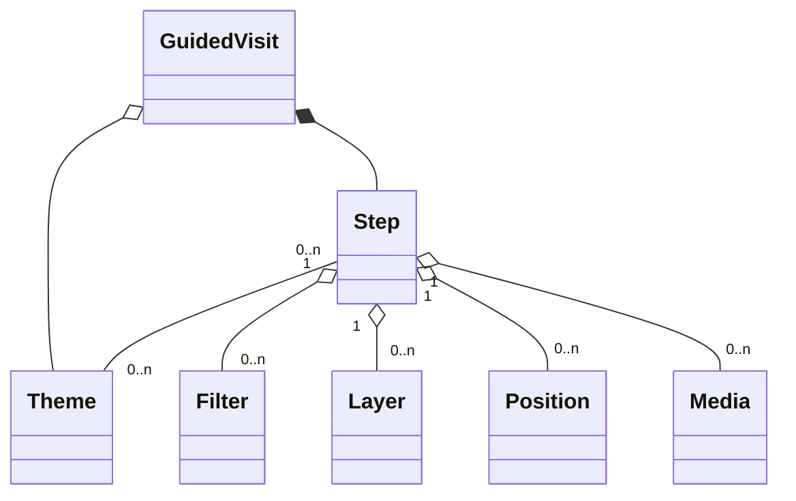

# Vallée du Gier

This demo offers tools to create 3D and geographic storytellings with urban data, geographic layers and medias. The demo uses [UD-Viz](https://github.com/VCityTeam/UD-Viz) to create the 3D view and to host it on the web.

Different examples are available with the demo (see [install and run the demo](#installing-and-running-the-demo)). Those examples are about [Vallée du Gier](./assets/layers/COMMUNES_GIER_4326.geojson)'s industry.


## Installing and running the demo

The demo application can be locally (on your desktop) started in the following way:

```bash
npm i
npm run build
python3 -m http.server
```

and then use your favorite (web) browser to open `http://localhost:8000/`.

## Configurate 3D View

### Layer configuration

The layers can be configured in [layerConfig.json](./assets/config/layerConfig.json).

### Layer captions

The captions can be configured in [captionConfig.json](./assets/config/captionConfig.json).

## About Guided Visits

Each guided visit is a sequence of steps, called `Nodes`. Each can have a geographic position, layers and medias (images, texts, etc), allowing to create a 3D and geographic storytelling.

### Visits

The visits can be configured in [visitConfig.json](./assets/config/visitConfig.json).



### Nodes

### Filters

### Medias

The medias can be configured in [mediaConfig.json](./assets/config/mediaConfig.json).

## About Open Visit

The open visit can be configured in [openVisitConfig.json](./assets/config/openVisitConfig.json).

### Contents

#### _Category_ Content

#### _Filter_ Content

### Layers

### Building Info
