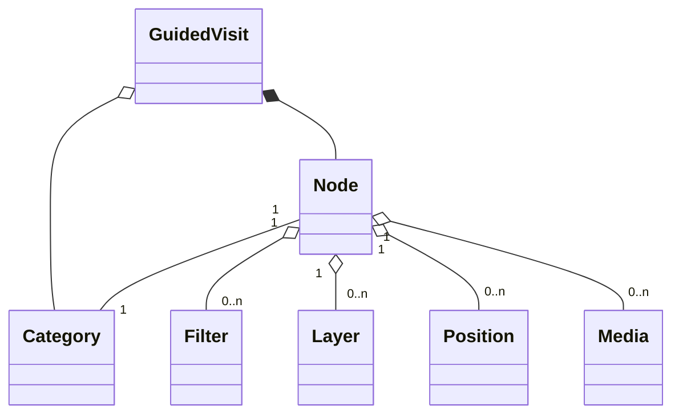

# Vallée du Gier

This demo offers tools to create 3D and geographic storytellings with urban data, geographic layers and medias. The demo uses [UD-Viz](https://github.com/VCityTeam/UD-Viz) to create the 3D view and to host it on the web.

Different examples are available with the demo (see [install and run the demo](#installing-and-running-the-demo)). Those examples are about [Vallée du Gier](./assets/layers/COMMUNES_GIER_4326.geojson)'s industry.


## Installing and running the demo

The demo application can be locally (on your desktop) started in the following way:

```bash
npm i
npm run build
python3 -m http.server
```

and then use your favorite (web) browser to open `http://localhost:8000/`.

## Configurate 3D View

### Layer configuration

The layers can be configured in [layerConfig.json](./assets/config/layerConfig.json).

The way to configure the layers depends on the [UD-Viz](https://github.com/VCityTeam/UD-Viz) version. You can check the [UD-Viz examples](https://github.com/VCityTeam/UD-Viz/tree/master/examples) for layer configuration examples.

### Layer captions

The captions can be configured in [captionConfig.json](./assets/config/captionConfig.json).

The caption style type can be either `plain`, `text`, `border` or `image`.

Example:

```json
{
  "description": "Layer 1",
  "id": "layer_01",
  "style": {
    "color": "#FF0000",
    "type": "plain"
  }
}
```

If the caption has the type `image`, replace `color` by a `path`:

```json
{
  "description": "Layer 2",
  "id": "layer_02",
  "style": {
    "path": "../assets/logos/caption_img.png",
    "type": "image"
  }
}
```

## About Guided Visits

Each guided visit is a sequence of steps, called `Nodes`. Each can have a geographic position, layers and medias (images, texts, etc), allowing to create a 3D and geographic storytelling.

### Visits

The visits can be configured in [visitConfig.json](./assets/config/visitConfig.json).

A `Visit` has a set of `Nodes`, a `startIndex` and a `endIndex`. Thoses indexes indicate which is the first step and the last step of the visit.

A `Visit` also has `Categories`. Those categories allow to navigate through the visit by theme, without seeing all the steps of the visit.



Example:

```json
{
  "id": "01",
  "name": "Example visit",
  "description": "This is an example of visit config",
  "startIndex": 0,
  "endIndex": 10,
  "categories": [], // See Categories
  "nodes": [] // See Nodes
}
```

### Nodes

Example:

```json
{
  "previous": 0,
  "next": 1,
  "type": "half",
  "layers": ["layer_id"],
  "medias": ["Media_01"],
  "position": {
    "x": 1815137.4389101316,
    "y": 5120561.345129335,
    "z": 74890.18365784828
  },
  "rotation": {
    "x": 0.20020493997826672,
    "y": 0.0010948816804666021,
    "z": 0.0053579998619824485,
    "w": 0.9797387790017721
  }
}
```

### Categories

Example:

```json
{
  "id": "INTRO",
  "name": "Introduction",
  "nodeIndex": 0
}
```

### Filters

Filter on JSON layer example:

```json
{
  "layer": "json_layer",
  "properties": {
    "COMMUNE": {
      "type": "string",
      "enum": ["AA", "BB"]
    }
  }
}
```

Filter on 3D Tiles layer example:

```json
{
  "layer": "3dtiles_layer",
  "properties": {
    "attribute": "attr_1",
    "attribute_values": ["A"],
    "style": {
      "materialProps": {
        "color": "#202020"
      }
    }
  }
}
```

### Medias

The medias can be configured in [mediaConfig.json](./assets/config/mediaConfig.json).


Media example:

```json
{
  "id": "Media_01",
  "name": "Name of the media",
  "contents": [] // See Contents
}
```

#### Media Contents

The configuration of media content changes depending on the content type.

**Text**: the value is raw text

Example:

```json
{
  "type": "text",
  "value": "This is raw text."
}
```

**Image**: the value is a link to an image (http or relative link)

Example:

```json
{
  "type": "image",
  "value": "../assets/media/images/IMG_01.jpg"
}
```

**Audio**: the value is a link to an audio (http or relative link)

Example:

```json
{
  "type": "audio",
  "value": "../assets/media/audios/AUD_01.mp3"
}
```

**Video**: the value is a link to a video (http or relative link)

Example:

```json
{
  "type": "video",
  "value": "../assets/media/videos/VID_01.mp4"
}
```

**Pin**: place an image at a geographic position in the 3D view. The value is a link to an image (http or relative link). The caption is displayed beside the image.

Example:

```json
{
  "type": "pin",
  "value": "../assets/media/images/IMG_01.jpg",
  "caption": "Pinned image caption",
  "position": {
    "x": 1826924.6322969063,
    "y": 5148677.232349239,
    "z": 266.6366424560547
  }
}
```

**File**: load the content of the file in a HTML div. The content of the file can be raw text or HTML. The value is a link to a text file (http or relative link).

Example:

```json
{
  "type": "file",
  "value": "../assets/media/texts/TXT_01.txt"
}
```

## About Open Visit

The open visit can be configured in [openVisitConfig.json](./assets/config/openVisitConfig.json).

Example:

```json
{
  "name": "Open Visit Example",
  "description": "This is an open visit example",
  "building_info": {}, // See Building Info
  "layers": [], // See Layers
  "contents": [] // See Contents
}
```

### Open Visit contents

#### _Category_ Content

Example:

```json
{
  "name": "Example category",
  "type": "category",
  "contents": [] // Each content of "contents" can be either Category or Filter
}
```

#### _Filter_ Content

Example:

```json
{
  "type": "filter",
  "layer": "layer_id",
  "id": "Filter_01",
  "default": "show",
  "properties": {
    "attribute": "attr_1",
    "attribute_values": ["A", "B", "C"],
    "style": {
      "materialProps": {
        "color": "#ff0000"
      }
    }
  }
}
```

### Layers

Example:

```json
{
  "id": "layer_id",
  "default": "show"
}
```

### Building Info

Example:

```json
{
  "name": "NAME",
  "layer": "layer_id",
  "fields": [
    {
      "attribute": "attr_1",
      "name": "Attribute 1"
    },
    {
      "attribute": "attr_2",
      "name": "Attribute 2"
    }
  ]
}
```
